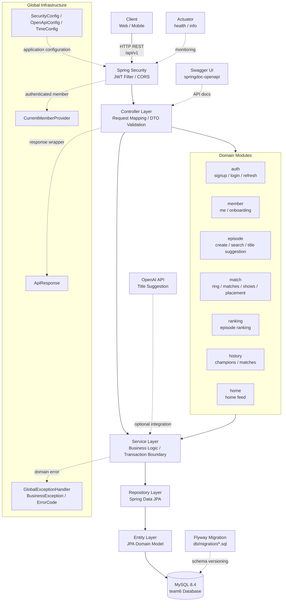

# Team 6 Backend

Java 21과 Spring Boot 3.5 기반의 REST API 서버입니다. 인증, 회원 온보딩, 에피소드, 매칭, 쇼 세션, 랭킹, 히스토리 기능을 제공하며 MySQL과 JPA를 사용합니다.

## 기술 스택

| 영역 | 기술 |
| --- | --- |
| Language | Java 21 |
| Framework | Spring Boot 3.5.3 |
| Build | Gradle Wrapper |
| Web | Spring Web MVC |
| Persistence | Spring Data JPA, Hibernate |
| Database | MySQL 8.4, H2 Test DB |
| Migration | Flyway |
| Security | Spring Security, JWT |
| Validation | Spring Validation |
| API Docs | springdoc-openapi, Swagger UI |
| Monitoring | Spring Boot Actuator |
| Test | JUnit 5, Spring Boot Test, Spring Security Test |

## 프로젝트 구조

```text
src/main/java/com/team6/server
├── auth        # 회원가입, 로그인, 토큰 재발급
├── member      # 내 정보, 온보딩 상태
├── episode     # 에피소드 생성, 조회, 검색, 제목 추천
├── match       # 링, 매칭, 쇼 세션, 배치
├── ranking     # 에피소드 랭킹
├── history     # 챔피언 및 매칭 이력
├── home        # 홈 화면 데이터
├── sample      # 인증 샘플 API
└── global      # 공통 응답, 예외, 보안, 설정
```

## 아키텍처 구조



계층 흐름은 `Client -> Security -> Controller -> Service -> Repository -> Entity -> Database` 순서입니다. 공통 응답, 예외 처리, 인증 사용자 조회, 설정 클래스는 `global` 패키지에서 횡단 관심사로 관리합니다.

## 실행 요구사항

- JDK 21
- Docker 또는 로컬 MySQL 8.x
- Git

Gradle은 Wrapper를 사용하므로 별도 설치가 필요하지 않습니다.

## 로컬 실행

1. 환경 변수 파일을 준비합니다.

```bash
cp .env.example .env
```

Windows PowerShell에서는 직접 `.env.example` 내용을 참고해 환경 변수를 등록하거나 IDE 실행 구성에 값을 넣습니다.

2. MySQL 컨테이너를 실행합니다.

```bash
docker compose up -d
```

기본 로컬 DB 접속 정보는 다음과 같습니다.

| 항목 | 값 |
| --- | --- |
| Host | localhost |
| Port | 3307 |
| Database | team6 |
| Username | team6 |
| Password | team6 |

3. 애플리케이션을 실행합니다.

```bash
./gradlew bootRun
```

Windows:

```bat
gradlew.bat bootRun
```

4. API 문서와 헬스 체크를 확인합니다.

- Swagger UI: `http://localhost:8080/swagger-ui.html`
- OpenAPI Docs: `http://localhost:8080/v3/api-docs`
- Health Check: `http://localhost:8080/actuator/health`

## 환경 변수

| 변수 | 기본값 | 설명 |
| --- | --- | --- |
| `SPRING_PROFILES_ACTIVE` | `local` | 활성 Spring Profile |
| `DB_URL` | `jdbc:mysql://localhost:3307/team6?...` | MySQL JDBC URL |
| `DB_USERNAME` | `team6` | DB 사용자명 |
| `DB_PASSWORD` | `team6` | DB 비밀번호 |
| `JWT_SECRET` | local 기본값 | JWT 서명 키. 운영 환경에서는 32바이트 이상의 랜덤 문자열 사용 |
| `CORS_ALLOWED_ORIGINS` | `http://localhost:3000,http://localhost:5173` | 허용할 프론트엔드 Origin |
| `OPENAI_TITLE_SUGGESTION_ENABLED` | `false` | 에피소드 제목 추천 OpenAI 연동 여부 |
| `OPENAI_API_KEY` | 빈 값 | OpenAI API Key |
| `OPENAI_BASE_URL` | `https://api.openai.com` | OpenAI API Base URL |
| `OPENAI_TITLE_MODEL` | 빈 값 | 제목 추천 모델명 |
| `OPENAI_CONNECT_TIMEOUT` | `2s` | OpenAI 연결 타임아웃 |
| `OPENAI_READ_TIMEOUT` | `8s` | OpenAI 읽기 타임아웃 |
| `OPENAI_TITLE_MAX_OUTPUT_TOKENS` | `40` | 제목 추천 최대 출력 토큰 |
| `OPENAI_TITLE_MAX_LENGTH` | `50` | 제목 최대 길이 |
| `LOCAL_DUMMY_DATA_ENABLED` | `false` | 로컬 더미 데이터 시딩 여부 |

## Profile 정책

| Profile | 용도 | 특징 |
| --- | --- | --- |
| `local` | 로컬 개발 | 기본 프로파일, MySQL 사용 |
| `dev` | 개발 서버 | 로깅 레벨 `INFO` |
| `prod` | 운영 | graceful shutdown, root log `WARN` |
| `test` | 테스트 | H2 인메모리 DB, `ddl-auto=create-drop` |

기본 `application.yml`에서는 `spring.profiles.default=local`입니다.

## 데이터베이스와 마이그레이션

마이그레이션 파일은 `src/main/resources/db/migration` 아래에 위치합니다.

```text
V1__init.sql
V2__create_product_feature_tables.sql
V3__add_scheduled_matching_event_status.sql
...
```

운영에 적용된 Flyway 파일은 수정하지 않고, 스키마 변경이 필요하면 새 버전 파일을 추가합니다.

현재 기본 설정은 다음과 같습니다.

- `spring.jpa.open-in-view=false`
- `spring.jpa.hibernate.ddl-auto=update`
- `spring.flyway.enabled=false`

운영 또는 배포 환경에서 Flyway를 활성화할 경우 `ddl-auto`와 마이그레이션 정책을 함께 점검해야 합니다.

## 인증과 보안

인증 방식은 JWT Bearer Token입니다.

보안 정책:

- `POST /api/v1/auth/**`: 인증 없이 접근 가능
- `GET /api/v1/sample/public`: 인증 없이 접근 가능
- `/swagger-ui/**`, `/swagger-ui.html`, `/v3/api-docs/**`: 인증 없이 접근 가능
- `GET /actuator/health`: 인증 없이 접근 가능
- `/api/**`: 인증 필요

보호 API 호출 시 다음 헤더를 사용합니다.

```http
Authorization: Bearer <ACCESS_TOKEN>
```

JWT 만료 시간:

| Token | 설정 키 | 기본값 |
| --- | --- | --- |
| Access Token | `jwt.access-expiration` | 1,800,000ms, 30분 |
| Refresh Token | `jwt.refresh-expiration` | 1,209,600,000ms, 14일 |

## 공통 응답 형식

모든 API 응답은 `ApiResponse<T>` 형식을 따릅니다.

```json
{
  "success": true,
  "code": "SUCCESS",
  "message": "요청에 성공했습니다.",
  "data": {}
}
```

실패 응답 예시:

```json
{
  "success": false,
  "code": "ERROR_CODE",
  "message": "오류 메시지"
}
```

## 주요 API

기본 Prefix는 `/api/v1`입니다.

### Auth

| Method | Path | 설명 |
| --- | --- | --- |
| `POST` | `/auth/signup` | 회원가입 |
| `POST` | `/auth/login` | 로그인 및 토큰 발급 |
| `POST` | `/auth/refresh` | Refresh Token 기반 토큰 재발급 |

### Member

| Method | Path | 설명 |
| --- | --- | --- |
| `GET` | `/members/me` | 내 정보 조회 |
| `GET` | `/members/me/status` | 온보딩 상태 조회 |
| `POST` | `/members/me/onboarding/complete` | 온보딩 완료 처리 |

### Home

| Method | Path | 설명 |
| --- | --- | --- |
| `GET` | `/home` | 홈 화면 데이터 조회 |

### Episode

| Method | Path | 설명 |
| --- | --- | --- |
| `POST` | `/episodes` | 에피소드 생성 |
| `POST` | `/episodes/title-suggestions` | 에피소드 제목 추천 |
| `GET` | `/episodes` | 에피소드 목록 조회 |
| `GET` | `/episodes/search` | 에피소드 검색 |
| `GET` | `/episodes/{episodeId}` | 에피소드 상세 조회 |

### Match and Show

| Method | Path | 설명 |
| --- | --- | --- |
| `GET` | `/ring` | 링 정보 조회 |
| `POST` | `/matches` | 매칭 생성 |
| `DELETE` | `/matches/{matchId}` | 매칭 취소 또는 삭제 |
| `POST` | `/matches/{matchId}/result` | 매칭 결과 등록 |
| `GET` | `/shows/available` | 참여 가능한 쇼 조회 |
| `POST` | `/shows/{showId}/sessions` | 쇼 세션 생성 |
| `GET` | `/shows/sessions/{sessionId}` | 쇼 세션 조회 |
| `POST` | `/placements/onboarding` | 온보딩 배치 |
| `POST` | `/episodes/{episodeId}/placement` | 에피소드 배치 |

### Ranking

| Method | Path | 설명 |
| --- | --- | --- |
| `GET` | `/rankings` | 랭킹 목록 조회 |

### History

| Method | Path | 설명 |
| --- | --- | --- |
| `GET` | `/history` | 히스토리 홈 조회 |
| `GET` | `/history/champions` | 챔피언 이력 조회 |
| `GET` | `/history/matches` | 매칭 이력 조회 |

## 인증 API 테스트 예시

```bash
curl http://localhost:8080/api/v1/sample/public
```

```bash
curl -i http://localhost:8080/api/v1/sample/me
```

```bash
curl -X POST http://localhost:8080/api/v1/auth/signup \
  -H "Content-Type: application/json" \
  -d '{"email":"user@example.com","password":"password123!","name":"테스트 사용자"}'
```

```bash
curl -X POST http://localhost:8080/api/v1/auth/login \
  -H "Content-Type: application/json" \
  -d '{"email":"user@example.com","password":"password123!"}'
```

```bash
curl http://localhost:8080/api/v1/sample/me \
  -H "Authorization: Bearer <ACCESS_TOKEN>"
```

## 테스트

전체 테스트:

```bash
./gradlew clean test
```

Windows:

```bat
gradlew.bat clean test
```

테스트 환경은 `src/test/resources/application.yml`을 사용하며 H2 인메모리 DB가 MySQL 호환 모드로 동작합니다.

## 빌드

```bash
./gradlew clean build
```

빌드 결과물:

```text
build/libs/server-team6-0.0.1-SNAPSHOT.jar
```

JAR 실행 예시:

```bash
java -jar build/libs/server-team6-0.0.1-SNAPSHOT.jar
```

## 개발 규칙

- 컨트롤러는 HTTP 요청/응답 변환에 집중합니다.
- 비즈니스 로직은 서비스 계층에 둡니다.
- DB 접근은 Repository 계층을 통해 수행합니다.
- API 응답은 `ApiResponse`로 래핑합니다.
- 도메인 예외는 `BusinessException`과 `ErrorCode`를 우선 사용합니다.
- 인증이 필요한 API에서는 `CurrentMemberProvider`를 통해 현재 회원을 조회합니다.
- 운영 적용 이후의 Flyway migration 파일은 수정하지 않습니다.

## 운영 체크리스트

- `JWT_SECRET`은 충분히 긴 랜덤 문자열로 교체합니다.
- 운영 DB 계정은 최소 권한 원칙으로 분리합니다.
- CORS Origin은 실제 프론트엔드 도메인만 허용합니다.
- Swagger 공개 범위는 배포 정책에 맞게 제한합니다.
- Actuator 노출 엔드포인트는 `health`, `info` 등 필요한 항목만 유지합니다.
- Flyway 활성화 여부와 JPA `ddl-auto` 정책을 배포 환경 기준으로 확정합니다.
